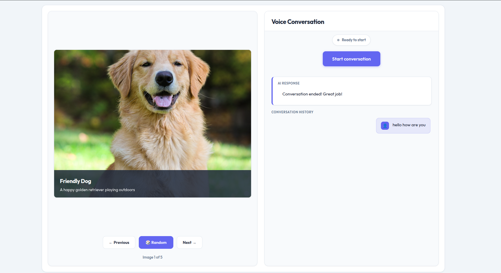

# AI Voice Conversation Interface

A real-time voice conversation app with an AI assistant while viewing educational images. Uses Groq's free AI API.

## Screenshot



## Quick Start

### 1. Get Free Groq API Key
- Visit [https://console.groq.com/keys](https://console.groq.com/keys)
- Sign up (free, no credit card)
- Copy your API key

### 2. Setup & Run
```bash
npm install
echo "VITE_GROQ_API_KEY=your_key_here" > .env.local
npm run dev
```

Open `http://localhost:5174`

## 📦 Build
```bash
npm run build      # Creates dist/ folder
npm run preview    # Test build locally
```

That's it! 🎉
